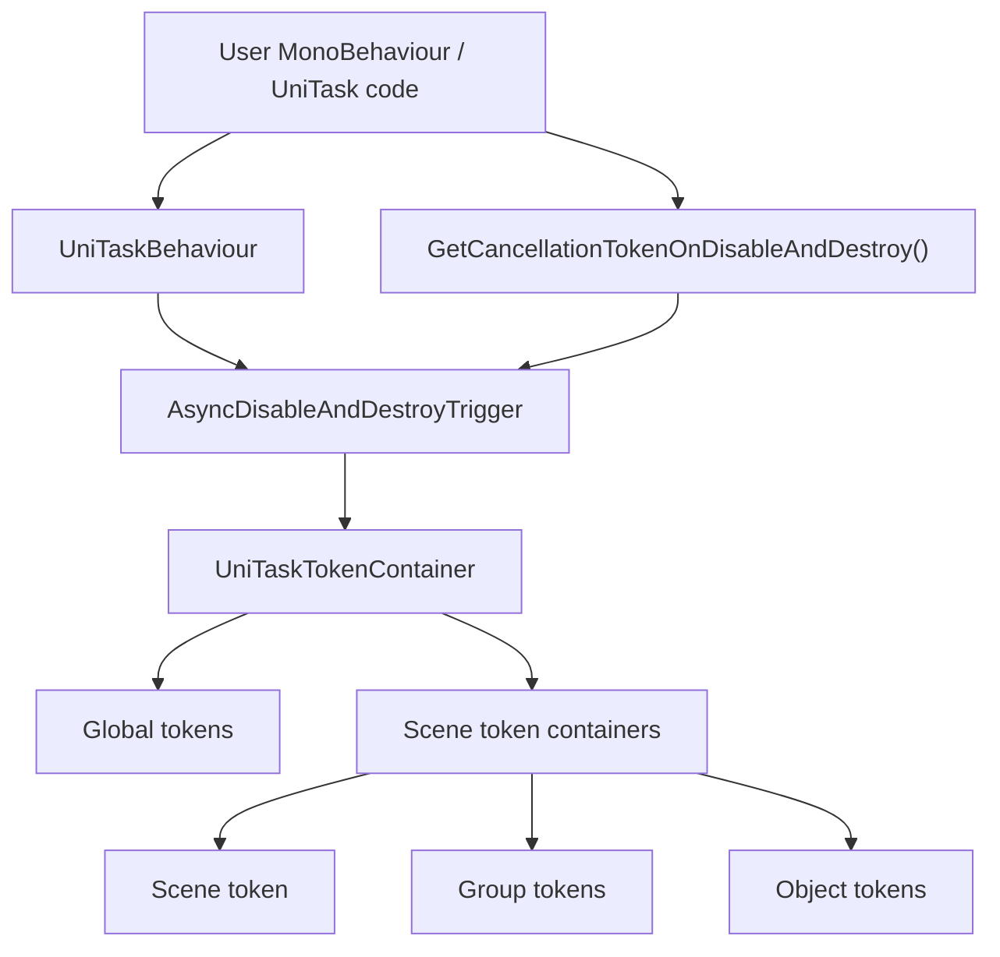
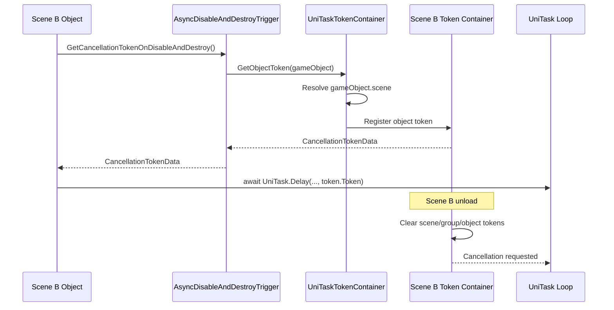
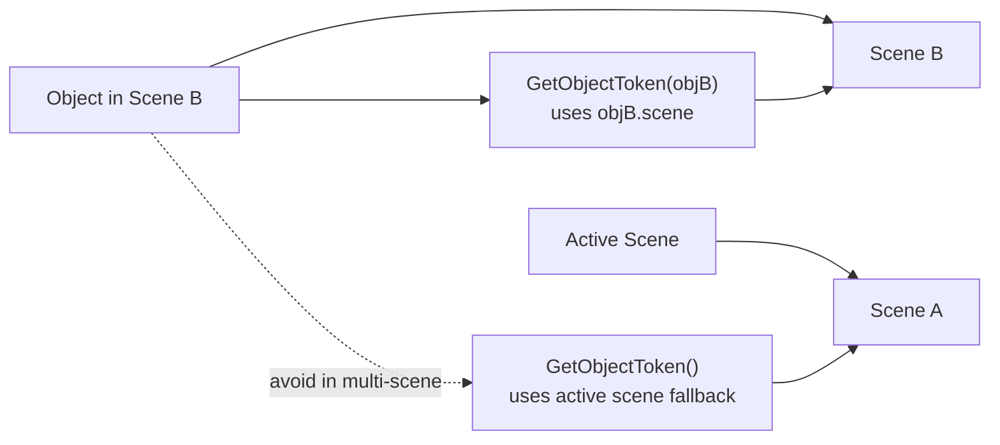

# Cubic UniTask Extension

Unity에서 `CancellationToken`을 씬, 오브젝트, 그룹 단위로 발행하고 관리하기 위한 UniTask 보조 패키지입니다.

이 패키지는 토큰 자체는 .NET `CancellationToken`으로 제공하지만, 주 사용 목적은 UniTask의 `UniTask.Delay`, async loop, fire-and-forget task 등에 전달할 취소 토큰을 안정적으로 관리하는 것입니다.

## Requirements

- Unity 2019.1 이상
- UniTask 선설치 필요

Unity Package Manager는 Git URL 패키지의 `package.json`에서 다른 Git 패키지를 자동 설치하지 않습니다. 따라서 이 패키지를 설치하기 전에 프로젝트 `Packages/manifest.json`에 UniTask를 먼저 추가해야 합니다.

```json
{
  "dependencies": {
    "com.cysharp.unitask": "https://github.com/Cysharp/UniTask.git?path=src/UniTask/Assets/Plugins/UniTask",
    "com.cubicengine.unitask-extension": "https://github.com/CubicSystem/cubic-unitask-extension.git#develop"
  }
}
```

현재 asmdef 상태:

- `Runtime/UniTaskExtension.asmdef`는 UniTask asmdef를 직접 참조하지 않습니다.
- `Tests/UniTaskExtension.Test.asmdef`는 테스트 코드가 UniTask 예제를 직접 사용하므로 UniTask asmdef GUID로 보이는 `GUID:f51ebe6a0ceec4240a699833d6309b23`을 참조합니다.
- `Editor/UniTaskExtension.Editor.asmdef`는 Runtime asmdef만 참조하며 Editor 전용입니다.

즉, Runtime 패키지 자체는 UniTask 하드 참조를 갖지 않지만, 이 패키지의 목적과 샘플 코드는 UniTask와 함께 쓰는 것을 전제로 합니다. 의도한 사용을 위해서는 UniTask를 먼저 설치하세요.

## Namespaces

```csharp
using CubicEngine.UnitaskExtension;
using static CubicEngine.UnitaskExtension.UniTaskTokenContainer;
```

| Area | Namespace |
| --- | --- |
| Runtime | `CubicEngine.UnitaskExtension` |
| Editor | `CubicEngine.UnitaskExtension.Editor` |
| Tests | `CubicEngine.UnitaskExtension.Tests` |

## Overview



토큰은 `UniTaskTokenContainer.CancellationTokenData`로 반환됩니다.

```csharp
public struct CancellationTokenData
{
    public CancellationToken Token { get; }
    public int TokenID { get; }
    public int SceneHandle { get; }
    public TokenType Type { get; }
    public bool IsValid { get; }
}
```

## Token Types

| Type | Scope | Lifetime |
| --- | --- | --- |
| `Global` | 프로젝트 전역 key | 직접 `Cancel`할 때까지 유지 |
| `Scene` | 특정 Unity Scene | 해당 씬 unload 시 cancel |
| `Group` | 특정 Scene 안의 string key | 직접 cancel 또는 해당 씬 unload 시 cancel |
| `Object` | 특정 Scene 안의 개별 발행 토큰 | owner disable/destroy, 직접 cancel, 또는 해당 씬 unload 시 cancel |

멀티씬 환경에서는 active scene에 의존하지 않도록 `GameObject`, `Component`, 또는 `Scene`을 명시해서 토큰을 발행하는 것을 권장합니다.

## Scene Ownership



## Basic Usage

### Direct Token Container

```csharp
using CubicEngine.UnitaskExtension;
using static CubicEngine.UnitaskExtension.UniTaskTokenContainer;
using Cysharp.Threading.Tasks;
using UnityEngine;

public sealed class TokenExample : MonoBehaviour
{
    private CancellationTokenData groupToken;

    private void Start()
    {
        var globalToken = UniTaskTokenContainer.GetGlobalToken("GlobalToken");
        var sceneToken = UniTaskTokenContainer.GetSceneToken(this);
        groupToken = UniTaskTokenContainer.GetGroupToken("Loading", this);
        var objectToken = UniTaskTokenContainer.GetObjectToken(this);

        RunAsync("scene", sceneToken).Forget();
        RunAsync("group", groupToken).Forget();
        RunAsync("object", objectToken).Forget();
    }

    private async UniTaskVoid RunAsync(string label, CancellationTokenData tokenData)
    {
        while(!tokenData.Token.IsCancellationRequested) {
            await UniTask.Delay(1000, cancellationToken: tokenData.Token);
            Debug.Log(label);
        }
    }

    private void OnDisable()
    {
        UniTaskTokenContainer.Cancel(groupToken);
    }
}
```

### Disable And Destroy Token

`GetCancellationTokenOnDisableAndDestroy()`는 대상 오브젝트의 씬에 object token을 등록합니다. 오브젝트가 비활성화되거나 파괴되면 해당 토큰이 cancel됩니다.

```csharp
using CubicEngine.UnitaskExtension;
using static CubicEngine.UnitaskExtension.UniTaskTokenContainer;
using Cysharp.Threading.Tasks;
using UnityEngine;

public sealed class DisableDestroyExample : MonoBehaviour
{
    private void OnEnable()
    {
        RunAsync().Forget();
    }

    private async UniTaskVoid RunAsync()
    {
        CancellationTokenData tokenData = this.GetCancellationTokenOnDisableAndDestroy();

        while(!tokenData.Token.IsCancellationRequested) {
            await UniTask.Delay(1000, cancellationToken: tokenData.Token);
            Debug.Log("running");
        }
    }
}
```

### UniTaskBehaviour

`UniTaskBehaviour<T>`는 내부 `AsyncDisableAndDestroyTrigger` 참조를 재사용하는 베이스 클래스입니다.

```csharp
using CubicEngine.UnitaskExtension;
using static CubicEngine.UnitaskExtension.UniTaskTokenContainer;
using Cysharp.Threading.Tasks;
using UnityEngine;

public sealed class BehaviourExample : UniTaskBehaviour<BehaviourExample>
{
    private CancellationTokenData tokenData;

    private void OnEnable()
    {
        tokenData = CreateToken();
        RunAsync().Forget();
    }

    private async UniTaskVoid RunAsync()
    {
        while(!tokenData.Token.IsCancellationRequested) {
            await UniTask.Delay(1000, cancellationToken: tokenData.Token);
            Debug.Log("tick");
        }
    }

    private void OnDisable()
    {
        Cancel(tokenData);
    }
}
```

## UniTaskTokenObject

`UniTaskTokenObject`는 string key를 ScriptableObject asset으로 관리하기 위한 타입입니다. 코드에 직접 key 문자열을 흩뿌리지 않고 GlobalToken 또는 GroupToken을 공유할 수 있습니다.

멀티씬에서 GroupToken으로 사용할 때는 호출자 오브젝트나 씬을 넘겨야 올바른 씬 컨테이너에 등록됩니다.

```csharp
using CubicEngine.UnitaskExtension;
using static CubicEngine.UnitaskExtension.UniTaskTokenContainer;
using Cysharp.Threading.Tasks;
using UnityEngine;

public sealed class TokenObjectExample : MonoBehaviour
{
    [SerializeField] private UniTaskTokenObject tokenObject;

    private void Start()
    {
        CancellationTokenData tokenData = tokenObject.GetTokenData(this);
        RunAsync(tokenData).Forget();
    }

    private async UniTaskVoid RunAsync(CancellationTokenData tokenData)
    {
        await UniTask.Delay(1000, cancellationToken: tokenData.Token);
    }

    private void CancelGroup()
    {
        tokenObject.Cancel(this);
    }
}
```

Editor 어셈블리는 `UniTaskTokenObject`의 빈 `tokenKey`에 asset GUID를 자동으로 채웁니다.

## Multi-Scene Notes



권장 사항:

- 오브젝트와 연결된 task는 `GetCancellationTokenOnDisableAndDestroy()`, `GetObjectToken(this)`, `GetGroupToken(key, this)`를 사용합니다.
- 명시적인 씬 스코프가 필요하면 `GetSceneToken(scene)`, `GetGroupToken(key, scene)`, `GetObjectToken(scene)`을 사용합니다.
- `GetSceneToken()`, `GetGroupToken(key)`, `GetObjectToken()` 같은 무인자 호출은 active scene fallback이므로 단일 씬 또는 명확히 active scene을 의도할 때만 사용합니다.
- 씬 unload 시 해당 scene handle에 등록된 Scene, Group, Object token은 모두 cancel됩니다.

## Public API Summary

| API | Purpose |
| --- | --- |
| `GetGlobalToken(string key)` | 전역 token 발행 또는 조회 |
| `ClearGlobalTokens()` | 모든 global token 취소 및 제거 |
| `GetSceneToken(...)` | scene scope token 발행 또는 조회 |
| `GetGroupToken(string key, ...)` | scene 안의 key 기반 group token 발행 또는 조회 |
| `GetObjectToken(...)` | scene 안의 object token 발행 |
| `Cancel(string key)` | active scene group token 및 global token 취소 |
| `Cancel(string key, Scene/GameObject/Component)` | 지정 scene의 group token 및 global token 취소 |
| `Cancel(int tokenID)` | 모든 scene container와 global token에서 ID 검색 후 취소 |
| `Cancel(CancellationTokenData tokenData)` | token data에 저장된 owner scene 기준으로 취소 |
| `IsCancelled(CancellationTokenData tokenData)` | token cancellation state 확인 |
| `GetCancellationTokenOnDisableAndDestroy()` | owner disable/destroy 시 취소되는 object token 발행 |
| `UniTaskBehaviour<T>.CreateToken()` | cached trigger를 통해 object token 발행 |
| `UniTaskTokenObject.GetTokenData(...)` | asset key 기반 global/group token 조회 |

## Package Layout

```text
Runtime/
  AsyncDisableAndDestroyTrigger.cs
  UniTaskBehaviour.cs
  UniTaskTokenObject.cs
  UnitaskTokenContainer.cs
  UniTaskExtension.asmdef

Editor/
  UniTaskTokenObjectEditor.cs
  UniTaskExtension.Editor.asmdef

Tests/
  Runtime/
  UniTaskExtension.Test.asmdef
```
